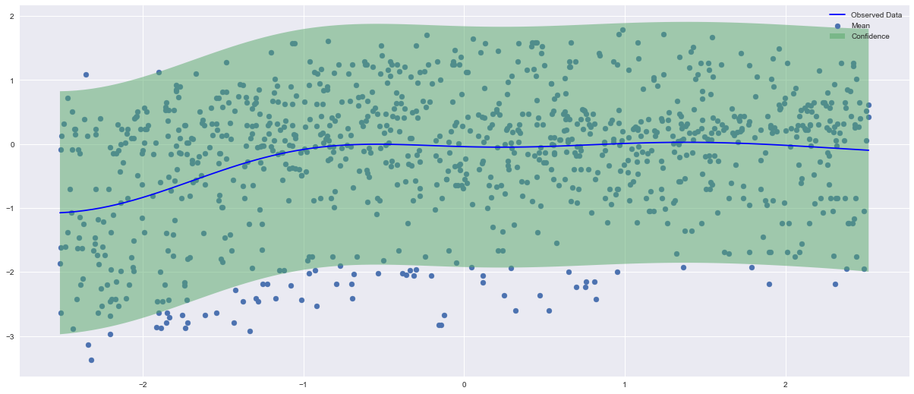
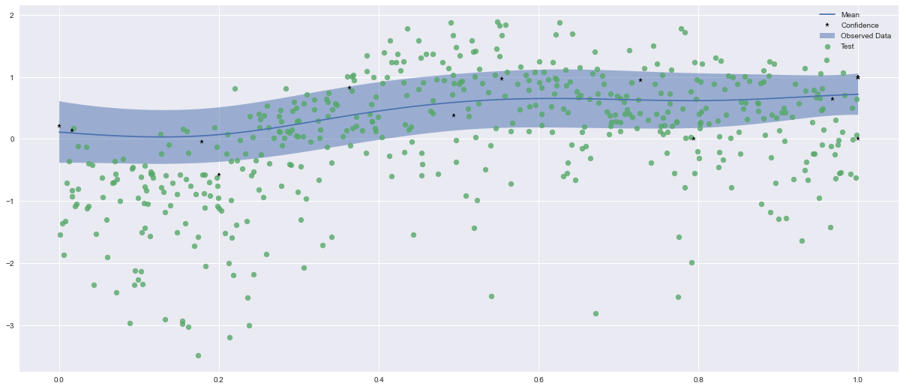
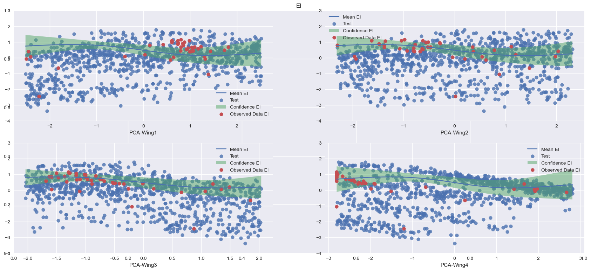

# MFBO Tutorial
**A Multi-Fidelity Bayesian Method for Complex Model Optimization: An Industrial Case Study**

MFBO is an efficient method for reducing uncertainty using multi fidelity and Bayesian optimization with a general overview of possible acquisition functions. It is developed for a undergraduate project at [Politecnico di Milano](https://www.polimi.it/) in a joint collaboration with [Università della Svizzera italiana](https://www.usi.ch)

### Installation
This tutorial required Anaconda or mamba being installed. After cloning the repository, set up the python environment using the command:
```sh
conda env create -f advpy.yml
```
Or fork the repository for having your own copy. The main modules depends on [botorch](https://botorch.org/) and [pytorch](https://pytorch.org/)

### Abstract
Computational models are often evaluated via stochastic simulation or numerical approximation. Fitting these models implies a difficult optimization problem over complex, possibly noisy parameter landscapes. The need for multiple realizations, as in uncertainty quantification or optimization, makes surrogate models an attractive option. For expensive high-fidelity models, however, even performing the number of simulations needed for fitting a surrogate may be too expensive. Inexpensive but less accurate low-fidelity data or models are often also available. Multi-fidelity combine high-fidelity and low-fidelity in order to achieve accuracy at a reasonable cost. Here we consider an hybrid method based on Multi-fidelity for implementing a Bayesian optimization algorithm. At the heart of this algorithm is maximizing the information criterion called acquisition function, and a list of the possible available choices is presented. Multi-fidelity Bayesian optimization achieves competitive performance with an affordable computational overhead for the running time of non-optimized models.

Here, it is shown the initial green uncertainty level described by the standard deviation before the MFBO method is applied:


Following, it is shown the EI acquisition function outcome applied to one input (angle of the cargo-wing industrial test case):


Finally, it is shown the result provided again by EI acquisition function after PCA performing, this time applied to all the inputs:


[L. Bonfiglio. Optimization and performance predictions using machine learning and
stochastic multi-fidelity modeling, 2018](https://web.mit.edu/~bonfi/www/multi-fidelity.html)

[C. E. Rasmussen & C. K. I. Williams, Gaussian Processes for Machine Learning, the MIT Press, 2006, ISBN 026218253X](http://gaussianprocess.org/gpml/)

[P. I. Frazier. A tutorial on bayesian optimization,
2018](https://arxiv.org/abs/1807.02811)

[B. Letham, B. Karrer, G. Ottoni, and E. Bakshy. Constrained bayesian optimization
with noisy experiments, 2018](https://arxiv.org/abs/1706.07094)

[S. Li, W. Xing, R. M. Kirby, and S. Zhe. Multi-fidelity bayesian optimization via deep
neural networks experiments, 2020.](https://proceedings.neurips.cc/paper/2020/hash/60e1deb043af37db5ea4ce9ae8d2c9ea-Abstract.html)
